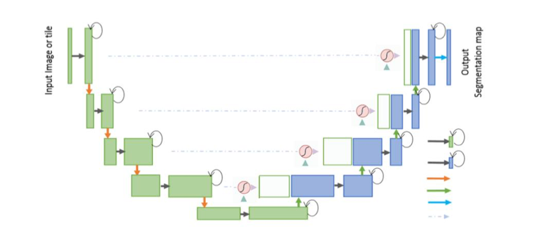
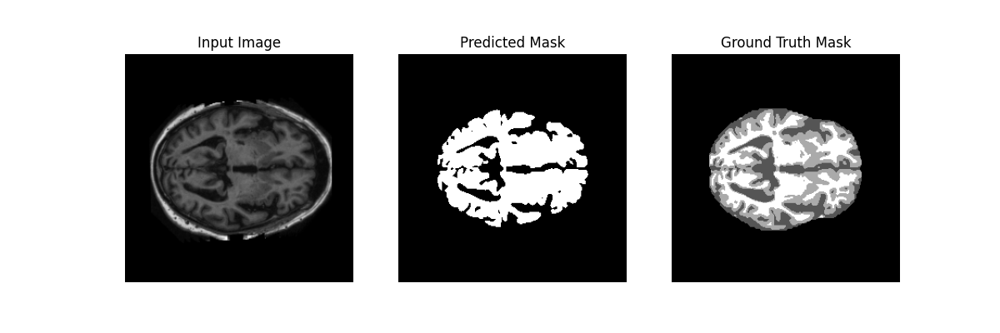
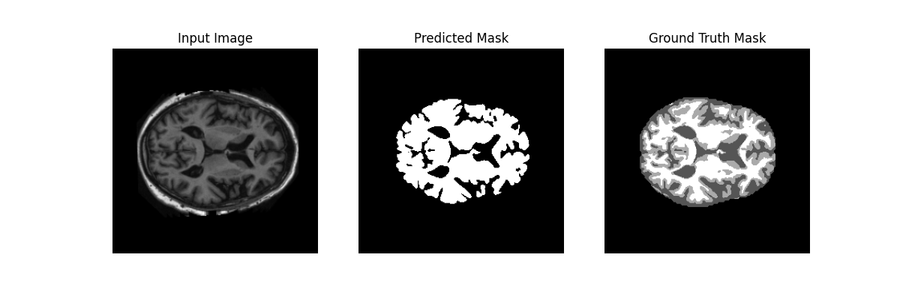

# **Improved UNet for 2D OASIS Brain Segmentation**
### _Lachlan Potter, 48011183_

## **Description**
This project implements a 2D Improved UNET model for segmentation of the OASIS brain dataset.
The goal is to segment brain slices into foreground (brain) and background, producing
masks that closely match ground truth annotations. The target was to obtain a
Dice similarity coefficient of greater than 0.9 across all images in the test set.

## How it works
The project utilises four .py files in combination to run successfully. The training script was run on a Mac using MPS (Metal Performance Shaders), however could be run on CPU if MPS is not available.


### _dataset.py_
The dataset.py script is used for loading the dataset into tensors. It creates a custom PyTorch
dataset using the 2D OASIS MRI images, converting them to a single channel (greyscale),
converting them to a tensor, and applying a default transform. The result is an (image, mask)
tuple, which is then used for splitting up the data and running through a DataLoader.

Example: 

        >>> dataset = OASISDataset("OASIS/keras_png_slices_train", "OASIS/keras_png_slices_seg_train")
        >>> img, mask = dataset[0]
        >>> img.shape, mask.shape
        (torch.Size([1, 256, 256]), torch.Size([1, 256, 256]))


### _modules.py_
The modules.py script forms the contains all the functionality for the Improved UNET model.
It consists of the four building block classes:
* DoubleConv

Applies two convolution sequences involving batch normalisation and ReLu activation to an image.
* Down

Downscaling block that reduces spatial resolution by a factor of 2 and increases feature depth.
* Up

Upscaling block that restores spatial resolution and fuses encoder and decoder
features through skip connections.
* OutConv

Performs a 1×1 convolution to map the feature maps from the final decoder layer
to the output channels.


These classes all attribute to the ImprovedUNET class.

### ImprovedUNET

The ImprovedUNET class assembles the building blocks from modules.py into a full encoder-decoder architecture for 2D image segmentation. The model consists of:

* Encoder:
A sequence of DoubleConv and Down blocks that progressively reduce spatial dimensions while increasing feature depth. The initial feature depth starts at 64 and doubles with each step. The final layer reaches 1024 // factor channels (self.factor), which accounts for bilinear upsampling adjustments.

* Decoder:
A sequence of Up blocks that progressively upsamples the feature maps and fuses them with corresponding encoder outputs through skip connections. The combination of encoder and decoder features ensures the network can leverage high-level and low-level information.
* Output layer:
OutConv applies a 1×1 convolution to reduce the feature map to the desired number of output channels, typically 1 for binary segmentation.


Forward pass workflow:

	1.	Input image is passed through DoubleConv to extract low-level features.
	2.	Features are downsampled through the encoder.
	3.	Decoder upsamples the features while concatenating skip connections from the encoder.
	4.	Final segmentation map is produced by outconv.



*Model Structure of UNET Diagram*

*Source: [Zixuan Wang et al., 2024](https://arxiv.org/abs/2409.08588)*


## _train.py_

### Configuration:
* Batch Size: 8
* Epochs: 1
* Optimiser: Adam
* Learning Rate: 0.01
* Epsilon: 0.00001
* Loss Function: BCEWithLogitsLoss
* Device: MPS (CPU if not available)


The train.py script handles training, validation, and checkpointing of the ImprovedUNET model
on the OASIS 2D brain dataset.

* Data Loading:
OASISDataset is utilised to load paired images and segmentation masks. The dataset is split into 80% training and 20% validation subsets using random_split, as well as DataLoader to handle batching and shuffling.

* Optimiser:
The script uses the Adam optimiser to update model parameters. Adam utilises adaptive learning rates for each parameter, which stabilises training and accelerates convergence, especially for networks like UNET.
* Loss function:
BCEWithLogitsLoss is used because the model outputs unnormalised logits for binary segmentation. This loss combines a sigmoid activation and binary cross-entropy in a numerically stable way. It is well-suited for pixel-wise classification where each pixel is either foreground (brain region) or background.
* Dice Coefficient Metric:
A custom dice function computes the Dice similarity coefficient for predicted masks, providing a quantitative measure of segmentation quality.

**_Training Loop:_**
    
    1.	For each epoch, the model is set to training mode.
	2.	Input batches are passed through the network to compute predictions.
	3.	Loss is calculated against the ground truth and backpropagated.
	4.	Optimiser steps update model weights.
	5.	Training loss and Dice scores are accumulated.

After each epoch, the model is evaluated on the validation set without gradient tracking. Loss and Dice scores are calculated to monitor generalisation. For safety, model weights are saved after each epoch.


### predict.py
The predict.py script demonstrates how to use a trained ImprovedUNET model to segment unseen OASIS 2D brain images and evaluate performance. The prediction script requires at least one epoch to have been completed, and saved to disk before running.

* Data Loading:
Uses OASISDataset to load test images and masks. DataLoader is used with a batch size of 1 to iterate through all test images.

* Model Loading:
The trained model weights are loaded from a checkpoint and moved to the selected device. The model is set to evaluation mode (model.eval()) to disable dropout and batch normalisation updates.

* Dice Coefficient:
Identical to in train.py. Each predicted mask is compared to the ground truth mask using the dice function. Dice scores for all test images are printed and stored for performance evaluation.

* Results:
Predicted masks are saved as PNG images in a predicted masks folder. For the first four images, the script displays side-by-side plots of the input image, predicted mask, and ground truth mask using matplotlib. This helps qualitatively verify segmentation quality. The script computes and prints the average Dice score over the dataset. This gives a performance metric summarising overall segmentation accuracy.

## Usage:
To begin, a Virtual Environment must be setup through the following steps:

```

python3 -m venv venv
source venv/bin/activate

```

The following libraries are required:
* _Python 3.9_
* _Pytorch 2.5.1_
* _Torchvision 0.15+_
* _PIL / Pillow_
* _Matplotlib_
* _pip_
* _os_

These libraries can be installed in a single step using _pip_:
```

pip install torch==2.5.1 torchvision==0.15.0 matplotlib pillow

```

The PNG slices must be in a folder inside your current directory, and sorted as follows:
```
OASIS/
├── keras_png_slices_train/
├── keras_png_slices_seg_train/
├── keras_png_slices_test/
├── keras_png_slices_seg_test/
├── keras_png_slices_validate/
├── keras_png_slices_seg_validate/
```

The data can be sourced from Rangpur, or [here](https://sites.wustl.edu/oasisbrains/).

From there, nothing else is required to run the script. Parameters can be changed inside train.py if needed.

To run the program, run train.py first, followed by predict.py after completion.

```

python train.py
python predict.py

```

or 

``` 

python train.py && python predict.py

```
Predicted masks and checkpoints will be saved to disk, and predict.py will display a subset of images like seen below.
## Results

After one epoch, ImprovedUNET model acheived a dice similarity of greater than 0.9 across all images on the test set.

```

Average Test Dice: 0.9812
Min Test Dice: 0.9388
Max Test Dice: 0.9898

```

### Sample Predictions

Visualisations of the model's performance on test samples can be seen below. Each image displays the input image, the model's predicted mask, and the ground truth for comparison. The dice score is written below the image.


Dice Score: 0.9735

Dice Score: 0.9798

Dice Score: 0.9802


## References


Al Qurri, A., & Almekkawy, M. (2023). Improved UNet with Attention for Medical Image Segmentation. Sensors (Basel, Switzerland), 23(20), 8589. https://doi.org/10.3390/s23208589

Basic writing and formatting syntax. (n.d.). GitHub Docs. https://docs.github.com/en/get-started/writing-on-github/getting-started-with-writing-and-formatting-on-github/basic-writing-and-formatting-syntax

Wang, Z., Chen, Y., Wang, F., & Bao, Q. (2024). Improved Unet model for brain tumor image segmentation based on ASPP-coordinate attention mechanism. ArXiv.org. https://arxiv.org/abs/2409.08588


